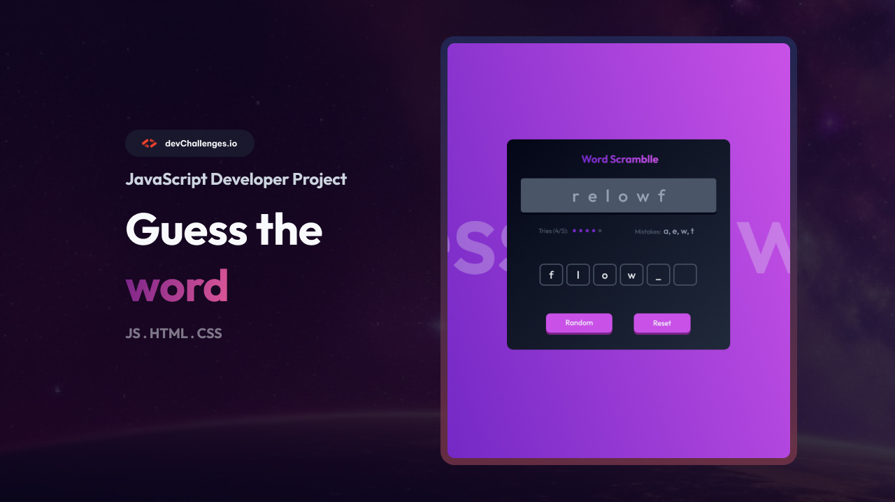
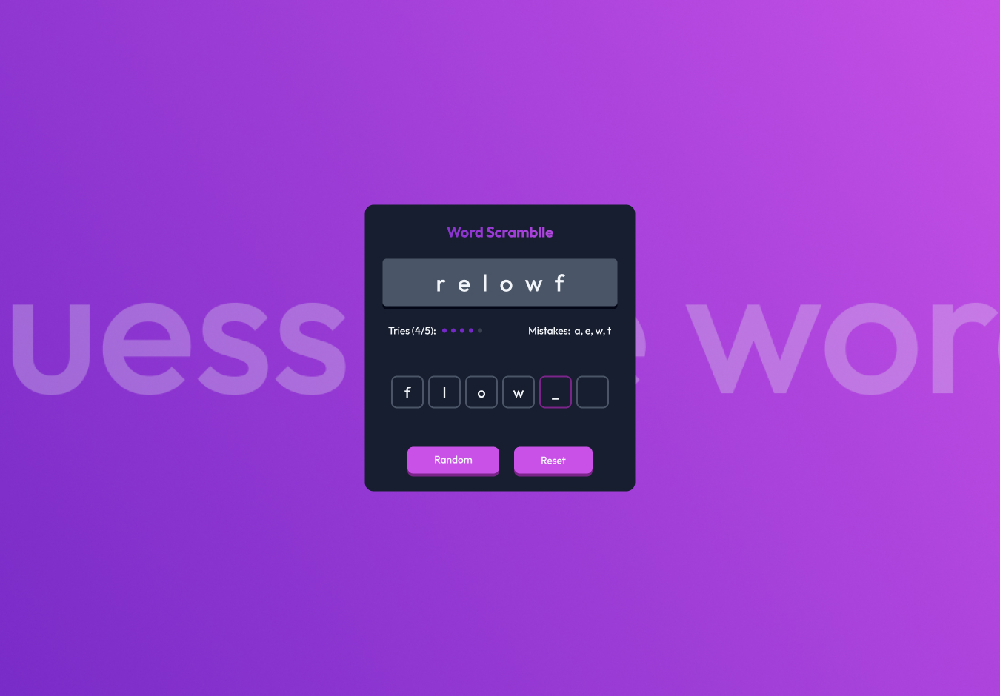
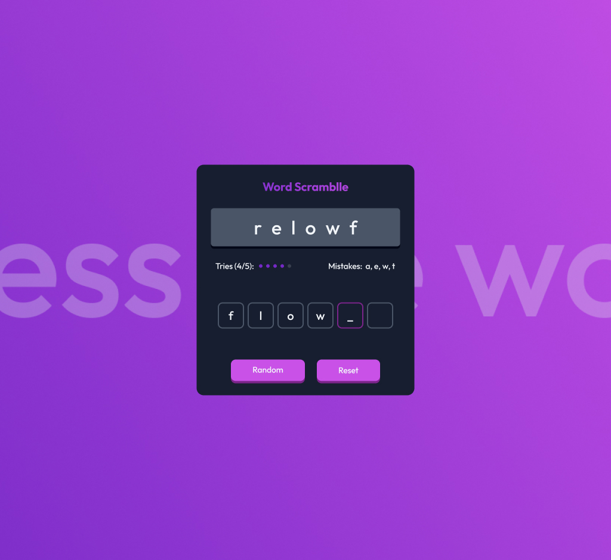
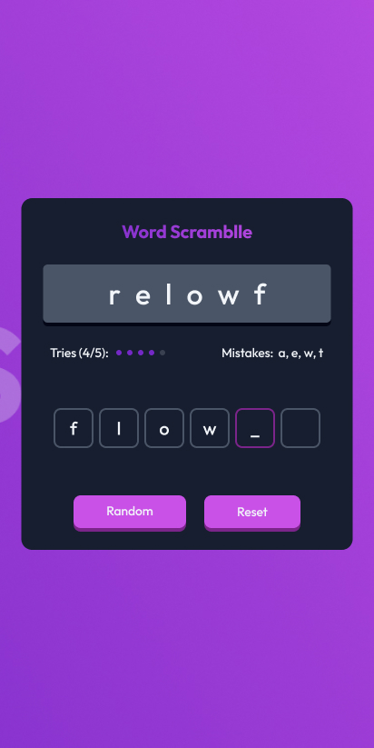

# Guess The Word Game

<div align="center">
  
</div>

<div align="center">
  <b>Responsive Word Scramble Game built for <a href="https://devchallenges.io/challenge/guess-the-word" target="_blank">devChallenges.io</a></b>
</div>


---

## 📝 Overview

Guess The Word Game is a fully responsive, interactive word scramble game. Users are challenged to guess the correct word from a scrambled set of letters, with a limited number of tries. The project is inspired by the devChallenges design and focuses on accessibility, responsiveness, and clean UI/UX.

---

## ✨ Features

- 🎨 Custom SVG logo as the game title
- 🖼️ Vibrant background image with overlay
- 📱 Fully responsive layout for desktop, tablet, and mobile
- 🔄 Randomize and reset functionality
- 📝 Animated tries and mistakes display
- ⌨️ Keyboard input for guessing
- ⚡ Fast, lightweight, and no dependencies

---

## 📷 Screenshots

<div align="center">
  
  
  
</div>

---

## 🛠️ Built With

- Semantic HTML5
- CSS Flexbox & Custom Properties
- Responsive Media Queries
- Vanilla JavaScript (ES6)

---

## 🏁 Getting Started

1. **Clone the repository:**
   ```bash
   git clone https://github.com/your-username/guess-the-word-game.git
   ```
2. **Open the project folder and launch `index.html` in your browser.**

No build step or dependencies required.

---

## 📱 Responsive Design

- The layout adapts seamlessly to all screen sizes using media queries.
- Font sizes, paddings, and button sizes scale for usability.
- The SVG logo and controls remain accessible and readable on all devices.

---

## 📚 Learnings

- Advanced responsive CSS with custom breakpoints and fluid units
- Using SVG for crisp, scalable branding
- Managing game state and user input in vanilla JavaScript
- Pixel-perfect implementation from a real-world design spec

---

## 👤 Author


- **Coded by**: Ayokanmi Adejola
- **Challenge by**: [devChallenges.io](https://devchallenges.io/)# Guess-The-Word
